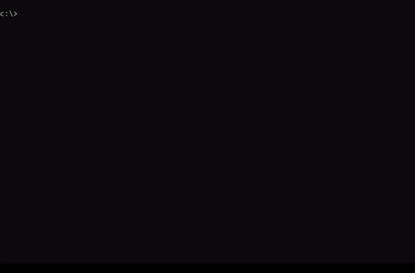

# BlueSploit

BlueSploit is the Metasploit of the Blue Team, because I was tired of seing Red Team frameworks, I created Bluesploit. I am using cmd2 module to create a Metasploit like environment.
 

BlueSploit is a DFIR framework with the main purpose being to quickly capture artifacts for later review.   
Most of the commands used are OS native commands. Native commands have their limitations, therefore, some executables will be used. I will reference all executables that are used on the bottom of this page along with links to their github page. 

The current implementation is focused on Windows environments. Some of the powershell commands will not work with windows 7 due to lack of backwards compatibility.  
 

Download the latest <a href="https://github.com/tsale/BlueSploit/releases">release</a>&nbsp;for windows.

 

 

Current stage of the project: <b>Beta</b> 
    

<strong>Upcoming Features:</strong>

<ul style="list-style-type: circle;">

<li>&#9745; Investigating registry keys</li>
<li>&#9745; Memory captures</li>
<li>&#9745; Live packet cptures</li>
<li>&#9745; Use of Strings to inspect executables</li>
<li>&#9745; Short term re-mediation of malicious artifact</li>
<li>&#9745; Blocking/Unblocking IPs</li>
<li>&#9745; Create timeline of events & and collect information for prefetch files (Using Nirsoft's tools)</li>
<li>&#9745; Collect ShellBags of specified user (Using Eric Zimmerman's SBECmd tool)</li>
<li>&#9745; Collect Browsing history (Using Using Nirsoft's tools)</li>
<li>&#9745; Searching for malicious documents using Yara</li>
<li>&#9745; Extract/Defang IOCs</li>
<li>&#9744; Killing malicious processes/services found</li>
<li>&#9744; Investigate suspicious network connections</li>
<li>&#9744; Dump all Log-On/Off events</li>

</ul>
<em>And much more...</em>  

Feel free to contribute! I will try to keep the code clean and easy to read.

    

<strong>A big thanks to the below projects for their contribution to the InfoSec community:</strong>

<ul>
<li>DeepBlueCLI from Sans (<a href="https://github.com/sans-blue-team/DeepBlueCLI">https://github.com/sans-blue-team/DeepBlueCLI)</a>
<li>Nirsoft for the amazing collection of tools (<a href="https://www.nirsoft.net">https://www.nirsoft.net)</a>
</li>
<li>Eric Zimmerman for his contribution with the forensic tools (<a href="https://ericzimmerman.github.io/">https://ericzimmerman.github.io)</a>
</li>
</ul>
  

<b><u><i>Disclaimer</i></u></b> 
   
<i>Comments,suggestions and constructive criticism are welcome. I am not a developer, I am an InfoSec analyst so any help with this project from all the developers(or hobbysist programmers) out there is very much appreciated.</i>

